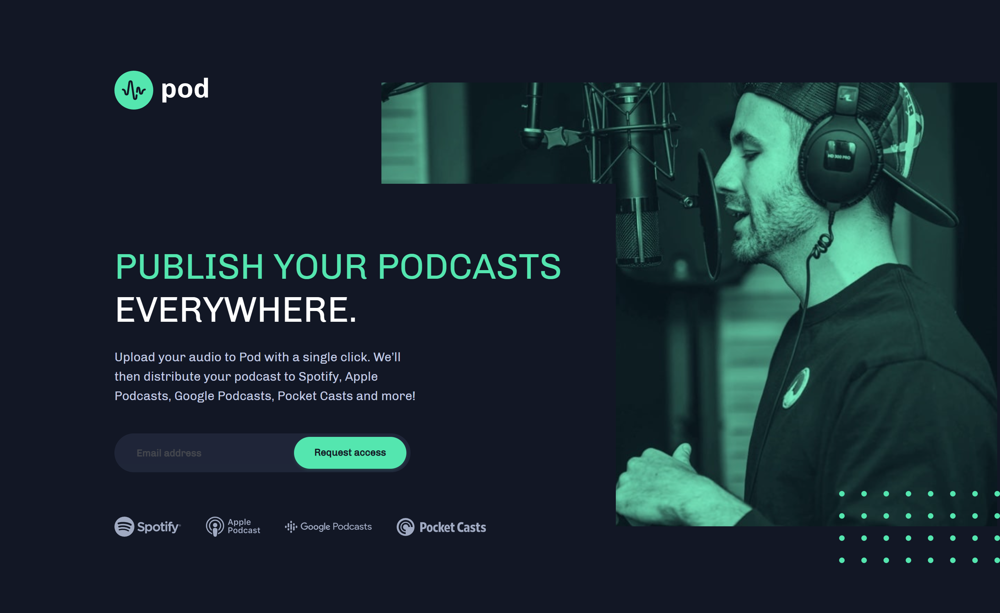

# Frontend Mentor - Pod request access landing page

This is my own solution to the [Pod request access landing page challenge on Frontend Mentor](https://www.frontendmentor.io/challenges/pod-request-access-landing-page-eyTmdkLSG). Frontend Mentor challenges help improve coding skills by building realistic projects. 

## Table of contents

- [Overview](#overview)
  - [The challenge](#the-challenge)
  - [Screenshot](#screenshot)
  - [Links](#links)
- [My process](#my-process)
  - [Built with](#built-with)
- [Author](#author)

## Overview

## The challenge

Users should be able to:

- View the optimal layout depending on their device's screen size
- See hover states for interactive elements
- Receive an error message when the form is submitted if:
  - The `Email address` field is empty should show "Oops! Please add your email"
  - The email is not formatted correctly should show "Oops! Please check your email"

### Screenshot

### Links

- Live Site URL: [Pod Request Access Landing Page](https://testerium-pod-request-access-landing-page.netlify.app/)

## My process

The project was actually not difficult, although it took me the most time to adjust the position of the images to the appropriate responsive views. Finally the project is fully responsive: desktop, tablet and mobile views were successfully implemented.

### Built with

- HTML
- CSS 
- SCSS
- Flexbox
- JavaScript

## Author

- Frontend Mentor - [@testerium](https://www.frontendmentor.io/profile/testerium)